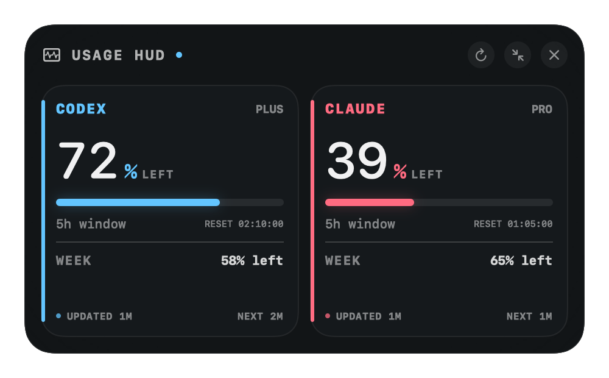

# Usage HUD

A private macOS heads-up display for Codex and Claude subscription limits. It floats above normal windows and full-screen apps, refreshes automatically, and lives in the menu bar when hidden.



## What it reads

- **Codex:** the installed `codex app-server` interface and its `account/rateLimits/read` request.
- **Claude:** the existing Claude Code login in macOS Keychain and Claude's account usage endpoint.

Credentials never leave your Mac except in the provider's own authenticated request. Usage HUD does not store or log tokens.

Diagnostic logs are stored locally at `~/Library/Application Support/Usage HUD/usage-hud.log`. Choose **Open Logs…** from the menu-bar gauge to inspect refreshes, HTTP status codes, `Retry-After` values, and backoff decisions. Logs rotate at 1 MB and never include credentials or response bodies.

Codex and Claude use independent timers and refresh every two minutes by default. Each provider schedules independently, so one cannot delay the other. The HUD shows when each reading last succeeded and when its next refresh is due. If Claude returns a rate limit, Usage HUD logs the raw `Retry-After` value, replaces its normal timer with a one-shot retry for that delay, and leaves Codex's timer untouched. During the cooldown, the HUD keeps the last successful Claude reading visible with a **STALE** marker. The cooldown survives an app restart, and an unusable or zero-second `Retry-After` value falls back to a conservative backoff.

Open **Settings…** from the menu-bar gauge to choose a 2, 5, 10, or 15-minute refresh cadence, show or hide either provider, and optionally show live values such as `C72 · A39` directly in the menu bar. Hidden providers are not polled. Reset and refresh countdowns can be enabled independently; compact mode keeps each reset timer inside its provider strip, places polling countdowns at the upper-left, and keeps a working refresh button at the upper-right.

The appearance controls include text scale, usage-bar thickness, corner radius, HUD opacity, independent provider colors, and vertical or horizontal compact layouts. **Always on Top** can keep the HUD above other windows or return it to normal window level. **Lock HUD** prevents movement and resizing; **Click Through** sends mouse input to the window underneath. All three remain available from the menu-bar menu.

Usage changes use restrained meter, number, status, and refresh animations. macOS **Reduce Motion** is respected automatically. On first launch, a three-step setup assistant checks for the Codex and Claude CLIs, selects providers and HUD layout, and optionally requests notification permission. The assistant can be run again at any time from the menu-bar menu.

Optional local notifications support a separate 0–30% warning threshold for each provider’s primary and secondary windows, plus reset detection. Secure Sparkle updates are checked once per day and downloaded and installed automatically by default. Update archives are verified with a dedicated Ed25519 signature before extraction.

## Install

Download the macOS zip from the [latest release](https://github.com/SmoothLayers/usagehud/releases/latest), unzip it, and open **Usage HUD.app**. This personal build is ad-hoc signed but not Apple-notarized, so macOS may ask you to control-click the app and choose **Open** on first launch.

## Build and run

Both `codex` and `claude` should already be signed in.

```sh
chmod +x scripts/build-app.sh
./scripts/build-app.sh
open "dist/Usage HUD.app"
```

The first Claude refresh may trigger a macOS Keychain permission prompt. Choose **Always Allow** so the HUD can refresh in the background.

Drag the HUD from any empty area. Resize it from any window border; normal and compact modes remember their own sizes. Choose **Reset Window Size** from the menu-bar gauge—or use the reset control in Settings—to restore the active mode to its normal dimensions. Usage HUD also remembers its position and restores it the next time it opens. If a display is disconnected, the window is moved onto a visible screen. Use the top-right controls to refresh, switch to compact mode, or hide it. Compact mode can stack Codex and Claude vertically or place them side by side. If the window is ever off-screen, **Show Usage HUD** repairs its size and moves it back onto a visible display. Once hidden, use the gauge icon in the menu bar to show it again.

## Troubleshooting

- **CLI not found:** make sure `codex` and `claude` are installed. NVM installations are detected automatically.
- **`env: node: No such file or directory`:** rebuild the app with the latest source. Usage HUD now carries the detected NVM binary directory into Codex's environment when launched from Finder.
- **Sign in message:** run `codex login` or `claude auth login`, then choose **Refresh Now** in the menu bar.
- **Claude login expired:** open Claude Code once and complete its login flow.
- **Unexpected refresh behavior:** choose **Open Logs…** from the gauge menu and inspect the latest Claude or Codex entries.

This app targets macOS 14 or newer and stays local; it does not require a server or separate API keys.
