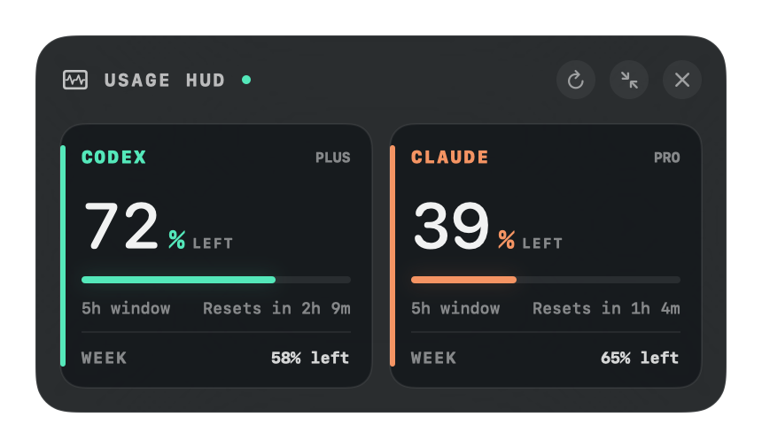

# Usage HUD

A private macOS heads-up display for Codex and Claude subscription limits. It floats above normal windows and full-screen apps, refreshes every minute, and lives in the menu bar when hidden.



## What it reads

- **Codex:** the installed `codex app-server` interface and its `account/rateLimits/read` request.
- **Claude:** the existing Claude Code login in macOS Keychain and Claude's account usage endpoint.

Credentials never leave your Mac except in the provider's own authenticated request. Usage HUD does not store or log tokens.

## Install

Download the macOS zip from the [latest release](https://github.com/SmoothLayers/usagehud/releases/latest), unzip it, and open **Usage HUD.app**. This personal build is ad-hoc signed but not Apple-notarized, so macOS may ask you to control-click the app and choose **Open** on first launch.

## Build and run

Both `codex` and `claude` should already be signed in.

```sh
chmod +x scripts/build-app.sh
./scripts/build-app.sh
open "dist/Usage HUD.app"
```

The first Claude refresh may trigger a macOS Keychain permission prompt. Choose **Always Allow** so the HUD can refresh in the background.

Drag the HUD from any empty area. Use the top-right controls to refresh, compact, or hide it. Once hidden, use the gauge icon in the menu bar to show it again. The menu also contains **Launch at Login**.

## Troubleshooting

- **CLI not found:** make sure `codex` and `claude` are installed. NVM installations are detected automatically.
- **`env: node: No such file or directory`:** rebuild the app with the latest source. Usage HUD now carries the detected NVM binary directory into Codex's environment when launched from Finder.
- **Sign in message:** run `codex login` or `claude auth login`, then choose **Refresh Now** in the menu bar.
- **Claude login expired:** open Claude Code once and complete its login flow.

This app targets macOS 14 or newer and stays local; it does not require a server or separate API keys.
