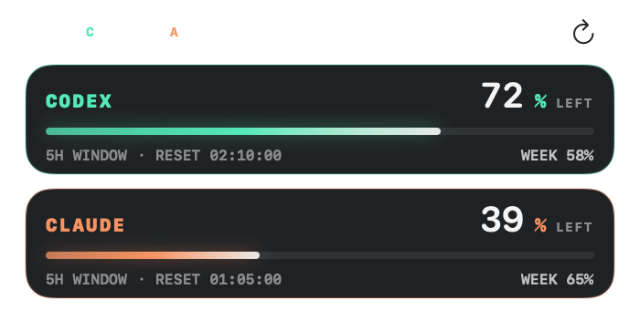
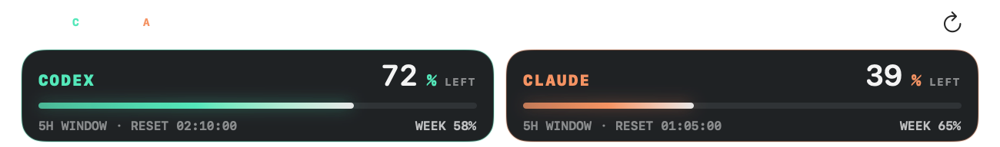

<div align="center">

# Usage HUD

**A tiny, private macOS heads-up display for your Codex and Claude subscription limits.**

Always know how much of your 5-hour and weekly usage windows is left —
at a glance, without leaving your editor or asking the CLI.

[](https://github.com/SmoothLayers/usagehud/releases/latest)
[](https://github.com/SmoothLayers/usagehud/releases)


[](LICENSE)


</div>

## What is this?

If you code with **Codex CLI** and **Claude Code** on subscription plans, your usage is metered
in rolling windows (a short 5-hour window plus a weekly one) — and the only way to check them is
to ask each tool individually. Usage HUD puts both meters in one small, always-available panel:

- **Remaining percentage** for each provider's current window, with a live countdown to the next reset
- **Weekly window** remaining at a glance
- A **menu bar readout** (optional) like `C72 · A39`, so you don't even need the panel open
- **Local notifications** when you're running low and when a window resets

Everything runs on your Mac. There is no server, no account, no analytics, and no separate API key —
it reuses the CLI sign-ins you already have.

## Install

1. Download the zip from the [**latest release**](https://github.com/SmoothLayers/usagehud/releases/latest)
2. Unzip and open **Usage HUD.app**
3. This personal build is ad-hoc signed but not Apple-notarized, so on first launch
   control-click the app and choose **Open** (or allow it under *System Settings → Privacy & Security*)

A three-step setup assistant checks for the Codex and Claude CLIs, lets you pick providers and a
layout, and optionally enables notifications. Requires **macOS 14+** on **Apple silicon**, with
`codex` and/or `claude` installed and signed in.

> The first Claude refresh may trigger a macOS Keychain prompt — choose **Always Allow** so the
> HUD can refresh in the background.

## How it works

| Provider | Source |
|----------|--------|
| **Codex** | Your installed `codex` CLI's `app-server` interface (`account/rateLimits/read`) |
| **Claude** | Your existing Claude Code sign-in from its scoped Keychain item, legacy Keychain item, or credentials file, sent only to Anthropic's own usage endpoint |

**Privacy:** credentials never leave your Mac except inside each provider's own authenticated
request. Usage HUD does not store or log tokens. Diagnostic logs stay local
(`~/Library/Application Support/Usage HUD/usage-hud.log`, rotated at 1 MB, never containing
credentials or response bodies) and can be opened from *Settings → Maintenance*.

**Polling:** each provider refreshes independently (Codex every 2 minutes and Claude every 5
minutes by default), so one provider can never delay the other. Hidden providers aren't polled.
If Claude rate-limits the usage endpoint, the HUD honors the `Retry-After` header (with a
conservative fallback backoff), keeps the last good reading visible with a **STALE** marker, and
remembers the cooldown across restarts. Ordinary failed readings expire after 30 minutes; a
rate-limited reading can remain visible for up to 24 hours while the required cooldown is active.
When menu bar percentages are enabled, a trailing `!` marks retained stale Claude data.

For fresher Claude data without extra usage-endpoint requests, Settings offers an opt-in **Live
Claude Updates** feed. It installs a silent local Claude Code status-line command, accepts only
token-protected loopback requests, and extracts only the `rate_limits` windows. If `ccstatusline`
is already configured, Usage HUD chains it and preserves its visible output; other custom status
lines are left untouched. Turning the option off restores the original `ccstatusline` entry.

## Everyday use

- **Move** it by dragging any empty area; **resize** from any edge — expanded and compact modes each remember their own size and position
- **Compact mode** shrinks each provider to a slim strip, stacked vertically or side by side
- **Always on Top** keeps the HUD above other windows (including full-screen apps) — or turn it off to let it behave like a normal window
- **Lock HUD** pins it in place; **Click Through** passes mouse input to whatever is underneath
- Hide it anytime — the **gauge icon in the menu bar** brings it back, and repairs the window if it ever ends up off-screen

## Compact mode

Choose a narrow vertical stack or place both providers side by side:

<div align="center">
<p><strong>Vertical</strong></p>


<p><strong>Horizontal</strong></p>

</div>

## Make it yours

<div align="center">

</div>

Settings covers text size, meter thickness, corner radius, opacity, an independent accent color
per provider, reset/refresh countdown toggles, and the menu bar readout. Usage alerts support a
separate warning threshold (off–30%) for each provider's current and weekly windows, plus
automatic reset detection. Animations are restrained, and macOS **Reduce Motion** is respected.

Updates are delivered by [Sparkle](https://sparkle-project.org): checked daily, verified with a
dedicated Ed25519 signature before extraction, and installed automatically (you can turn this off
or use **Check Now** in Settings).

## Build from source

Both `codex` and `claude` should already be signed in.

```sh
./scripts/build-app.sh
open "dist/Usage HUD.app"
```

Run the tests with `swift test`.

## Troubleshooting

| Symptom | Fix |
|---------|-----|
| CLI not found | Install `codex` / `claude`. Homebrew, `~/.local/bin`, NVM, and login-shell `PATH` setups are detected automatically |
| "Sign in" message | Run `codex login` or `claude auth login`, then **Refresh Now** from the menu bar |
| Claude login expired | Open Claude Code once and complete its login flow |
| Unexpected refresh behavior | *Settings → Maintenance → Open Logs* shows every refresh, HTTP status, `Retry-After` value, and backoff decision |

## License

[MIT](LICENSE)
