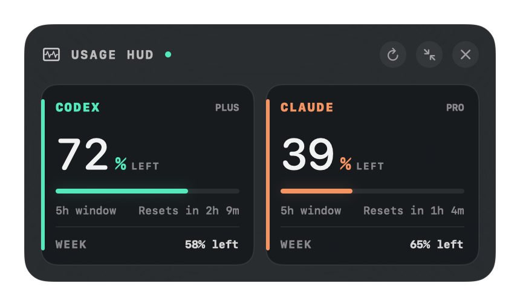
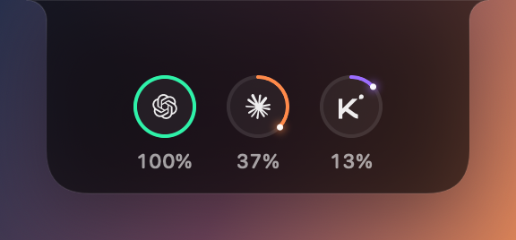
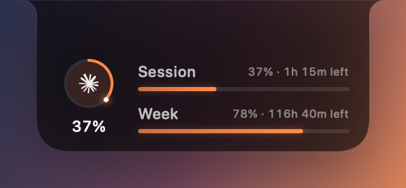
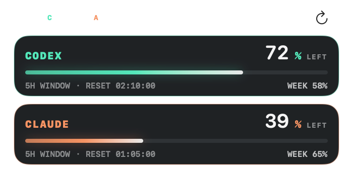
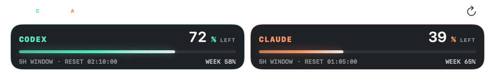
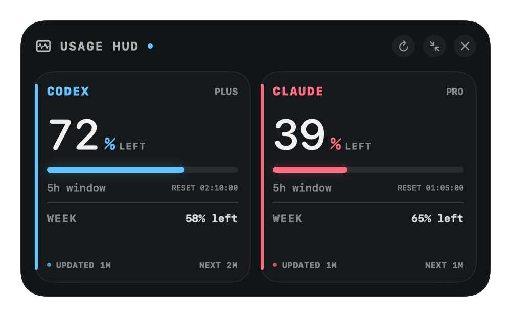

<div align="center">

# Usage HUD

**A tiny, private macOS heads-up display for your Codex, Claude, and Kimi subscription limits.**

[](https://github.com/SmoothLayers/usagehud/releases/latest)
[](https://github.com/SmoothLayers/usagehud/releases)

[](LICENSE)
[](https://buymeacoffee.com/smoothlayers)



</div>

## What is this?

Codex CLI, Claude Code, and Kimi Code meter subscription usage in rolling windows: a 5-hour
window plus a weekly one. The only built-in way to check them is to ask each tool individually.
Usage HUD puts all the meters in one small panel, with a live countdown to each reset, an
optional menu bar readout like `C72 · A39 · K84`, an optional notch tray, and notifications when
you run low or a window resets.

Everything runs on your Mac. No server, no account, no analytics, no separate API key. It reuses
the CLI sign-ins you already have.

## Install

1. Download the zip from the [latest release](https://github.com/SmoothLayers/usagehud/releases/latest)
2. Unzip and open Usage HUD.app
3. The build is ad-hoc signed but not notarized, so on first launch control-click the app and
   choose Open

A setup assistant walks you through the rest. Requires macOS 14+ on Apple silicon, with at least
one supported CLI installed and signed in.

> The first Claude refresh may trigger a Keychain prompt. Choose **Always Allow** so the HUD can
> refresh in the background.

## How it works

| Provider | Source |
|----------|--------|
| Codex | Your installed `codex` CLI's `app-server` interface |
| Claude | Your existing Claude Code sign-in, sent only to Anthropic's own usage endpoint |
| Kimi | Your existing Kimi Code sign-in, sent only to Kimi's coding usage endpoint |

Credentials never leave your Mac except inside each provider's own authenticated request.
Diagnostic logs stay local and never contain credentials or response bodies.

Each provider refreshes on its own schedule (Codex every 2 minutes, Claude and Kimi every 5). If
a provider rate-limits the HUD, it backs off and keeps the last good reading visible with a
STALE marker.

For fresher Claude data without extra requests, Settings offers an opt-in feed that reads usage
from a silent local Claude Code status-line command. It accepts only token-protected loopback
requests and chains an existing `ccstatusline` setup instead of replacing it.

## Notch mode

Turn on Notch Mode and the HUD gets a second home. Point at the camera housing and a tray slides
out from under it with a gauge ring per provider. Move away and it retracts.

<div align="center">

</div>

Hover a ring and its session and weekly meters unfold next to it, each with a live countdown.
Click any ring to bring the full HUD forward. Macs without a notch get the same tray from a hot
zone at the top centre of the screen.

<div align="center">

</div>

## Compact mode

Shrinks each provider to a slim strip, stacked vertically or side by side:

<div align="center">
<p><strong>Vertical</strong></p>


<p><strong>Horizontal</strong></p>

</div>

## Make it yours

<div align="center">

</div>

Drag to move, resize from any edge; Always on Top, Lock, and Click Through are in the menu.
Settings covers text size, meter thickness, opacity, per-provider accent colors, warning
thresholds, and the menu bar readout. [Sparkle](https://sparkle-project.org) delivers signed
automatic updates, which you can turn off.

## Build from source

```sh
./scripts/build-app.sh
open "dist/Usage HUD.app"
```

Run the tests with `swift test`.

## Troubleshooting

| Symptom | Fix |
|---------|-----|
| CLI not found | Install `codex`, `claude`, or `kimi`. The app finds Homebrew, `~/.local/bin`, NVM, and login-shell `PATH` setups on its own |
| "Sign in" message | Run `codex login`, `claude auth login`, or `kimi`, then Refresh Now from the menu bar |
| Claude login expired | Open Claude Code once and complete its login flow |
| Unexpected refresh behavior | *Settings → Maintenance → Open Logs* shows every refresh and backoff decision |

## Support

Usage HUD is free and always will be. If it saves you a trip to the CLI, a
[star on GitHub](https://github.com/SmoothLayers/usagehud) helps other people find it, and if
you'd like to support development you can
[buy me a coffee](https://buymeacoffee.com/smoothlayers). Either one is appreciated.

## License

[MIT](LICENSE)
